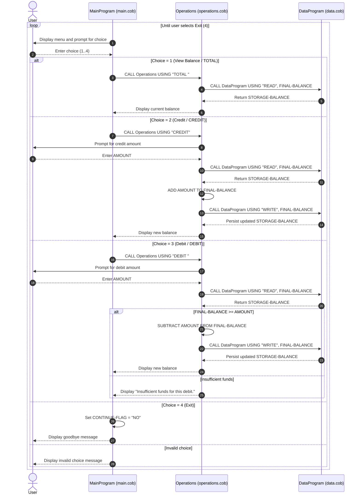

# Student Account Management System — COBOL Documentation

## Overview

This COBOL application implements a simple student account management system with a menu-driven interface. It supports viewing an account balance, crediting funds, and debiting funds, with basic business rule enforcement (e.g., overdraft prevention).

---

## File Descriptions

### `src/cobol/main.cob`

**Program ID:** `MainProgram`

**Purpose:** Entry point of the application. Presents an interactive menu to the user and dispatches control to the `Operations` program based on the user's selection.

**Key Logic:**

- Runs a loop (`PERFORM UNTIL CONTINUE-FLAG = 'NO'`) that repeatedly displays the menu until the user chooses to exit.
- Accepts a single-digit menu choice (`USER-CHOICE`) and uses an `EVALUATE` statement to branch:

| Choice | Action |
|--------|--------|
| `1`    | Calls `Operations` with `'TOTAL '` — view current balance |
| `2`    | Calls `Operations` with `'CREDIT'` — credit (add funds to) account |
| `3`    | Calls `Operations` with `'DEBIT '` — debit (withdraw funds from) account |
| `4`    | Sets `CONTINUE-FLAG` to `'NO'`, ending the loop and exiting |
| Other  | Displays an invalid choice message |

---

### `src/cobol/operations.cob`

**Program ID:** `Operations`

**Purpose:** Business logic layer. Receives an operation code from `MainProgram` and performs the corresponding account operation by interacting with `DataProgram` for balance reads and writes.

**Key Functions / Paragraphs:**

| Operation Code | Behaviour |
|----------------|-----------|
| `'TOTAL '`     | Reads the current balance via `DataProgram` and displays it |
| `'CREDIT'`     | Prompts for an amount, reads the balance, adds the amount, and writes the updated balance back via `DataProgram` |
| `'DEBIT '`     | Prompts for an amount, reads the balance, and only subtracts the amount if sufficient funds exist; otherwise displays an error |

**Business Rules:**

- **Minimum balance / overdraft prevention:** A debit is only processed when `FINAL-BALANCE >= AMOUNT`. If the account has insufficient funds, the transaction is rejected with the message `"Insufficient funds for this debit."` No negative balances are permitted.
- **Default balance:** The working-storage field `FINAL-BALANCE` is initialised to `1000.00`. This serves as the starting balance when the data store has not yet been written.
- **Operation codes are fixed-length (6 characters):** Trailing spaces are significant — `'TOTAL '` and `'DEBIT '` include a trailing space to satisfy the `PIC X(6)` picture clause. Any mismatch will cause the operation to be silently ignored.

---

### `src/cobol/data.cob`

**Program ID:** `DataProgram`

**Purpose:** Data persistence layer. Acts as an in-memory data store for the account balance, simulating a simple read/write interface to an underlying storage field.

**Key Logic:**

| Operation Code | Behaviour |
|----------------|-----------|
| `'READ  '`     | Copies the internal `STORAGE-BALANCE` to the `BALANCE` linkage field, making it available to the caller |
| `'WRITE '`     | Copies the caller-supplied `BALANCE` linkage field into `STORAGE-BALANCE`, persisting the new value for the session |

**Data Fields:**

| Field | Type | Default | Description |
|-------|------|---------|-------------|
| `STORAGE-BALANCE` | `PIC 9(6)V99` | `1000.00` | In-memory balance store; persists for the lifetime of the program run |

**Business Rules:**

- **Initial balance:** Student accounts start with a balance of `1000.00` (currency units, e.g. dollars or credits).
- **Session-only persistence:** The balance is held in working-storage and is not written to an external file or database. All changes are lost when the program terminates.
- **No validation in data layer:** `DataProgram` performs no bounds or validity checking — all business rules (e.g., overdraft prevention) are enforced exclusively in `Operations`.

---

## Data Flow

```
MainProgram (main.cob)
    │
    │  CALL 'Operations' USING <operation-code>
    ▼
Operations (operations.cob)
    │
    │  CALL 'DataProgram' USING 'READ'  / 'WRITE', <balance>
    ▼
DataProgram (data.cob)
    │
    │  Reads/writes STORAGE-BALANCE
    ▼
  (in-memory balance field)
```

---

## Business Rules Summary

| Rule | Location | Description |
|------|----------|-------------|
| Starting balance is `1000.00` | `data.cob`, `operations.cob` | Both programs initialise their respective balance fields to `1000.00` |
| No overdrafts allowed | `operations.cob` | Debit is rejected if `FINAL-BALANCE < AMOUNT` |
| No negative balances | `operations.cob` | Balance can only be reduced to `0.00` at minimum |
| Session-only persistence | `data.cob` | Balance changes are not saved to disk; the session resets on restart |
| No concurrent access protection | All files | The system is single-user; no locking or concurrency mechanisms exist |

---

## Running the Application

This application requires a COBOL compiler (e.g., GnuCOBOL). Compile and run all three programs together, nominating `MainProgram` as the entry point:

```bash
# Compile
cobc -x -o account_system src/cobol/main.cob src/cobol/operations.cob src/cobol/data.cob

# Run
./account_system
```

---

## Sequence Diagram (Mermaid)


